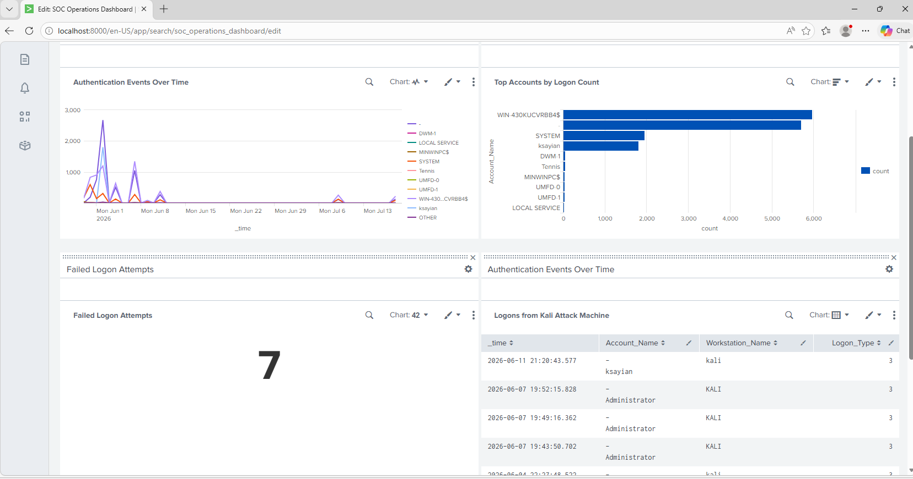
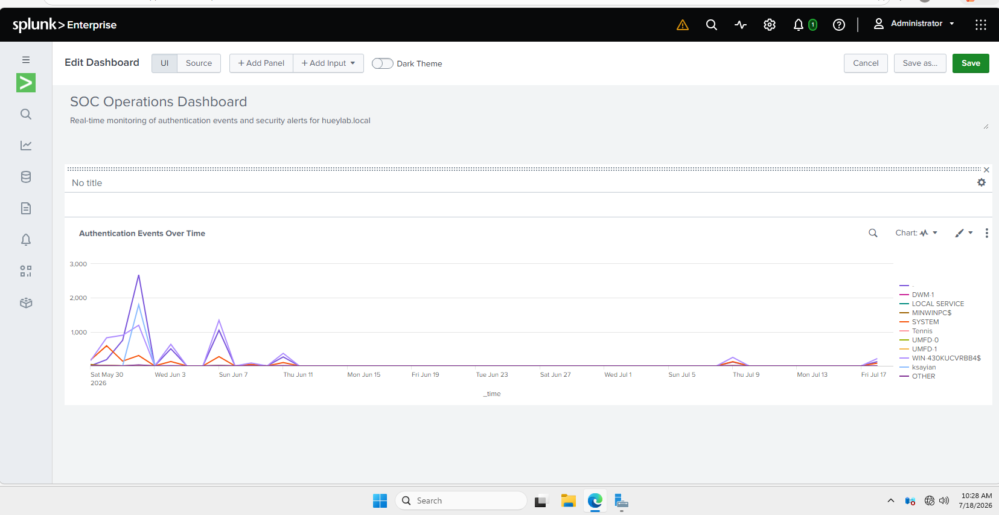
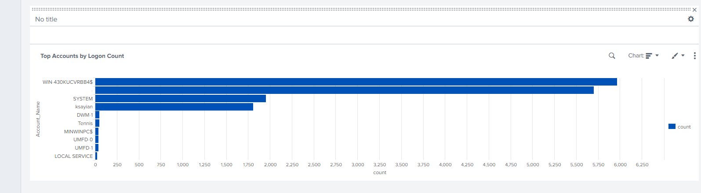
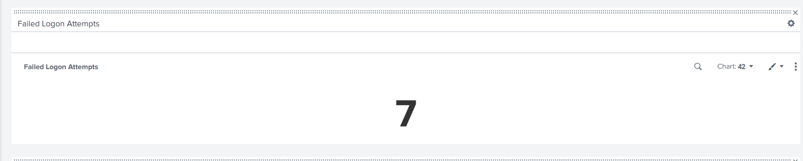
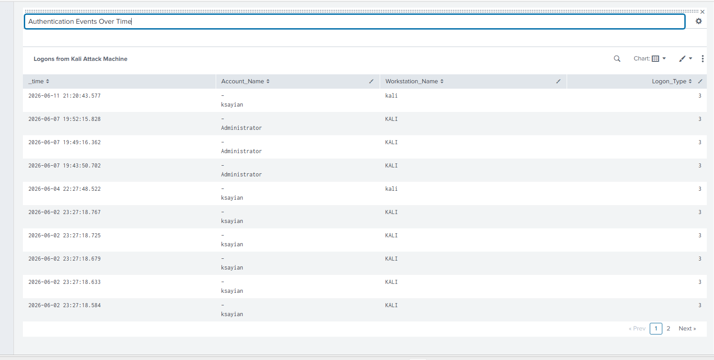

# Phase 5 — Splunk SOC Operations Dashboard

Built a multi-panel SOC Operations Dashboard in Splunk Enterprise using data 
collected from real attack sessions against hueylab.local. The dashboard provides 
real-time visibility into authentication events, account activity, failed logon 
attempts, and attack traffic from the Kali Linux machine.

## Dashboard Overview

## Dashboard Panels

1. Authentication Events Over Time — line chart showing logon activity across all sessions

2. Top Accounts by Logon Count — bar chart identifying most active accounts

3. Failed Logon Attempts — single value counter for brute force detection

4. Logons from Kali Attack Machine — forensic table showing all attack traffic

## SPL Queries Used
- Panel 1: index=main source="WinEventLog:Security" EventCode=4624 | timechart count by Account_Name
- Panel 2: index=main source="WinEventLog:Security" EventCode=4624 | stats count by Account_Name | sort -count | head 10
- Panel 3: index=main source="WinEventLog:Security" EventCode=4625 | stats count
- Panel 4: index=main source="WinEventLog:Security" EventCode=4624 Workstation_Name=kali | table _time, Account_Name, Workstation_Name, Logon_Type | sort -_time | head 20

## Author
Houston Jones | Atlanta, GA
GitHub: hjones360
Medium: medium.com/@agentjones
